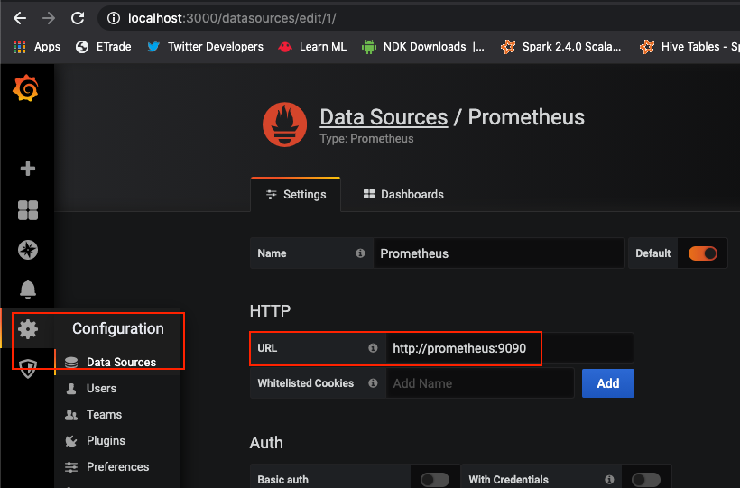

# Monitoring pipeline

## Docker Compose (dev local)

Just start with ```docker-compose up```

Monitoring

* Grafana : [http://localhost:3000/](http://localhost:3000/) (Login / Pwd : admin / admin)
* Prometheus : [http://localhost:9090/](http://localhost:9090/)
* Prometheus Targets : [http://localhost:9090/targets](http://localhost:9090/)

## Prometheus

### Node Exporter

ATTENTION **CONFIGURE YOUR OWN IP** AS LOCALHOST NOT SUPPORTED !!

Configure your spring application using :

```
  - job_name: 'spring-actuator'
    metrics_path: '/actuator/prometheus'
    scrape_interval: 5s
    static_configs:
	   - targets: ['x.y.z.v:8080']
```

### Troubleshooting

ATTENTION : docker node-exporter is pulling using local IP. You may need to check if the IP configured is correct in file [/infra/docker/prometheus/prometheus.yml](/infra/docker/prometheus/prometheus.yml)

Check if Prometheus Node-Exporter Dashboard at ```/targets``` url :

* From docker : [http://localhost:9090/targets](http://localhost:9090/targets)

If something is wrong, you can try to open the URL  yourself at ```http://x.y.z.v:8080/actuator/prometheus```


## Grafana Dashboard

### Add datasource

* Grafana : [http://localhost:3000/](http://localhost:3000/) (Login / Pwd : admin / admin)

Add datasource using Prometheus from Grafana **docker instance** configure access **using DNS** and not localhost !

* [http://prometheus:9090](http://prometheus:9090)




### Import Dashboard

Go to Dashboard > Manage > Import button :

* Type the ID for the desired dashboard (ex : ```4701```)
* Select the previously configured datasource
* Click import

Interesting dashboard :

* [JVM (Micrometer) - 4701](https://grafana.com/grafana/dashboards/4701)
* [Spring Boot 2.1 Statistics - 10280](https://grafana.com/grafana/dashboards/10280)

### with Prometheus

Prometheus is a TSDB (TimeSerie DataBase), meanings all metrics data points will always contains a Time. To see different metrics types, you can refer to this blog to correctly fetch metrics :

* [https://blog.pvincent.io/2017/12/prometheus-blog-series-part-2-metric-types/](https://blog.pvincent.io/2017/12/prometheus-blog-series-part-2-metric-types/)

Histogram details :

* [prometheus.io - Histograms and Summaries](https://prometheus.io/docs/practices/histograms/)
* [blog.pvincent.io - Histograms: sampling observations](https://blog.pvincent.io/2017/12/prometheus-blog-series-part-2-metric-types#histograms-sampling-observations)

Query language for Prometheus :

* [PromQL](https://prometheus.io/docs/prometheus/latest/querying/basics/)
* Syntax for Range Vector Selectors ```http_requests_total{job="prometheus"}[5m]```
* Can create week over week with : ```rate(http_requests_total[5m] offset 1w)```
* Can query multiple metrics with ```{__name__=~"job:.*"}```

### Troubleshooting

ATTENTION : Inside Grafana **docker instance** configure access to prometheus **using DNS** and not localhost !

* [http://prometheus:9090](http://prometheus:9090)


#### Alerts

Tips for Grafana Alert :
[https://www.robustperception.io/reduce-noise-from-disk-space-alerts](https://www.robustperception.io/reduce-noise-from-disk-space-alerts)


## Application Adoption

### Import the JAR

```XML
<dependency>
    <groupId>com.github.frtu.logs</groupId>
    <artifactId>logger-metrics</artifactId>
    <version>${frtu-logger.version}</version>
</dependency>
```

Check the latest version (clickable) :

[](https://search.maven.org/#search%7Cga%7C1%7Ca%3A%22logger-metrics%22+g%3A%22com.github.frtu.logs%22)

### Spring Annotation

Import Spring Configuration :

```java
@Import({MetricsConfig.class, ...})
```

### Spring Properties

```properties
# =================================
# Metrics related configurations
# =================================
# https://www.callicoder.com/spring-boot-actuator/
management.endpoints.web.exposure.include=*

management.endpoint.health.show-details=always

management.endpoint.metrics.enabled=true
management.endpoint.prometheus.enabled=true

management.metrics.export.prometheus.enabled=true
```

### Custom measurement

This library provide a class to abtract from direct Counter & Timer :

* *com.github.frtu.metrics.micrometer.model.Measurement*

```java
final Iterable<Tag> tags = ...;

final Measurement measurement = new Measurement(registry, operationName);
measurement.setOperationDescription(operationDescription);
measurement.setTags(tags);

try (MeasurementHandle handle = new MeasurementHandle(measurement)) {
    return joinPoint.proceed();
} catch (Throwable ex) {
    throw MeasurementHandle.flagError(ex);
}
```

### See more

* [micrometer.io prometheus installation](http://micrometer.io/docs/registry/prometheus#_installing)
* [Concepts & Metrics naming](https://micrometer.io/docs/concepts)

