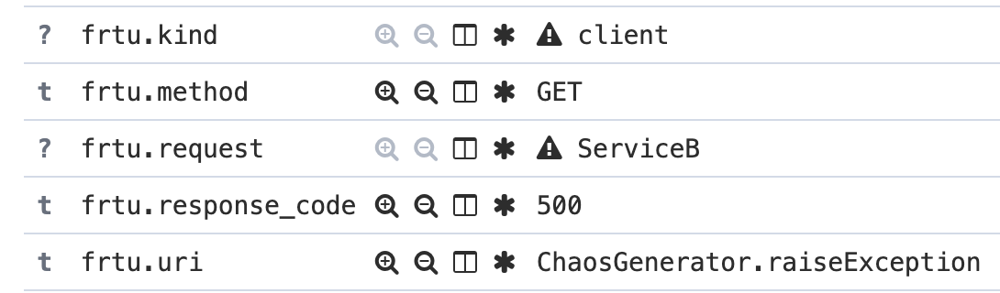
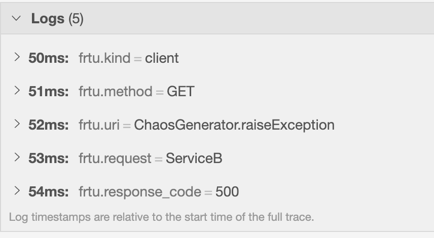
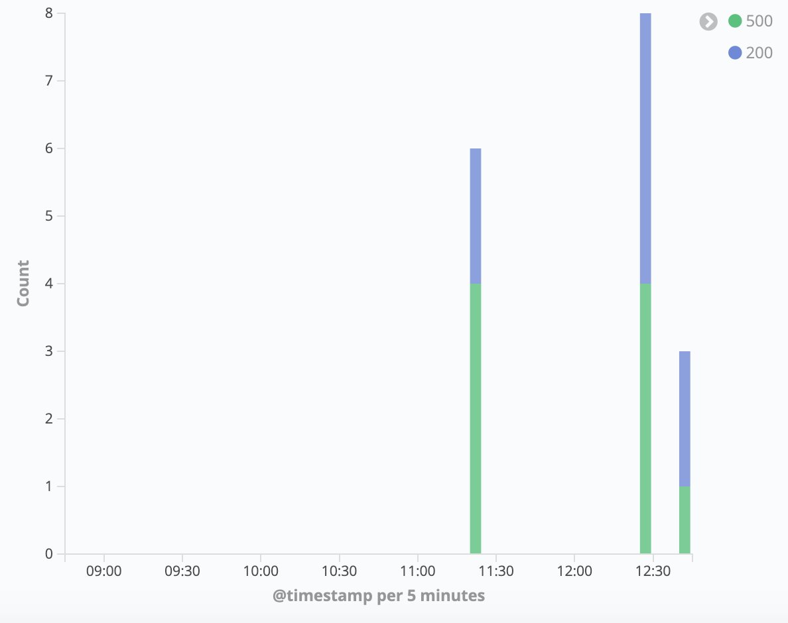

# Full guide for Structured Logging

## Java API

**logger-core** offer 2 API (Simple and RPC-way) to log & trace infos :

* com.github.frtu.logs.core.StructuredLogger
* com.github.frtu.logs.core.RpcLogger

### StructuredLogger

* Log in console **with JSON**
* Log in Elastic Search with **dedicated document field**
* Also allow to Trace the **same info** with Logs

#### Logs

Allow to create new dimension in ElasticSearch. Initialize the logger similar with Slf4j LOGGER :

```java
final static StructuredLogger STRUCTURED_LOGGER = StructuredLogger.create("usage");
```

Then use it for logging String or Integer values :

```java
STRUCTURED_LOGGER.info(entry("key1", "value1"), entry("key2", "value2"));
STRUCTURED_LOGGER.info(entry("key1", 123), entry("key2", 456));
```

Gives a JSON log :

```json
{"key1":"value1","key2":"value2"}
{"key1":123,"key2":456}
```

#### Log namespace

You can also add **prefix to each log key**

```java
final StructuredLogger STRUCTURED_LOGGER_PREFIX = 
						StructuredLogger.create("usage", "com", "frtu");
...
```

Gives a log :

```json
{ "com.frtu.key1":"value1", "com.frtu.key2":"value2" }
```

But also prefix in Kibana :



#### Log context

You can also pre-generate **entry array** using *entries()* method :

```java
final Map.Entry[] entries = entries(client(),
        method("GET"),
        uri(ChaosGenerator.OPERATION_NAME_RAISE_EXCEPTION),
        requestBody(helloTo, false));

try {
    ...
    STRUCTURED_LOGGER.info(entries, responseBody(response, false), statusCode(200));
} catch (Exception e) {
    STRUCTURED_LOGGER.warn(entries, statusCode(500));
}
	
```


#### Logs & Tracer same infos

Also pass **traceHelper** as first parameter of log method :

```java
@Autowired
private TraceHelper traceHelper;

...
STRUCTURED_LOGGER.info(traceHelper, entries, statusCode(200));
```



### RpcLogger

Implementation to logs RPC calls, in a generic way :

* RESTful
* GraphQL
* etc..

#### RESTful sample

Logging REST request & response API

```java
final RpcLogger rpcLogger = RpcLogger.create("rest");

rpcLogger.info(client(),
        method("POST"),
        uri("/v1/users/"),
        requestBody("{ \"user\": { \"name\": \"Fred\" }}", true),
        responseBody("{ \"id\": \"1234\" }", false),
        statusCode("201")
);
```

Gives a log (also observe request is **inlined**, but NOT response) :

* kind : client | server
* method : GET | POST | PUT | DELETE
* uri : String
* request
* response
* response_code : 200 | 404 | 500

```json
{
   "kind":"client",
   "method":"POST",
   "uri":"/v1/users/",
   "request":{
      "user":{
         "name":"Fred"
      }
   },
   "response":"{ \"id\": \"1234\" }",
   "response_code":"201"
}
```

#### GraphQL sample

Logging API errors :

```java
rpcLogger.warn(client(),
    method("query"),
    uri("/HeroNameAndFriends"),
    statusCode("123"),
    errorMessage("The invitation has expired, please request a new one")
);
```

Gives a log :

* kind : client | server
* method : query | mutation | subscription
* uri : String
* response_code

```json
{
   "kind":"client",
   "method":"Query",
   "uri":"/HeroNameAndFriends",
   "response_code":"123",
   "error_message":"The invitation has expired, please request a new one"
}
```

## Kibana aggregation

### Response code metrics

* Visualize > New.. > **Vertical Bar**
* Data > Metrics > **Y-Axis** = Aggregation:Count
* Buckets > **X-Axis** = Aggregation:Date Histogram | Field:**@timestamp**
* Split Series = Sub Aggregation:Terms | Field:**response_code**

For Y-Axis, can also click *Advanced*, JSON Input :

* { "kind":"client", "uri":"xx" }

